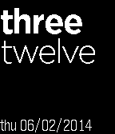
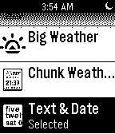

Pebble Text Watch
=================

On the first launch of Pebble SDK, TextWatch application was not part of the code examples.
Many people wanted to change the texts into their own language and with this app we hope that others will improve it 
and translate it into many more languages.

This watch is a modification of the built in Text Watch face to add date information and to correct the time representation for times that have a spoken zero (10:02 as "ten oh two"). First, a short digression on spoken time in english, when the time is spoken at 10:00 as "ten o'clock" the "o'clock" is a contraction of the phrase "of the clock" in contrast to 10:02 where the "oh" is a synonym for "zero".  If one wished to express the spoken zero as a contraction, " 'o " might be appropriate, but "oh" is more common.  Care has been taken to use the same built in fonts for a consistent and clean look and feel.

This is a modification of the excellent work by [stough](https://github.com/stough/PebbleTextWatch) to make the date much smaller and include the full year.

Screenshot:  

